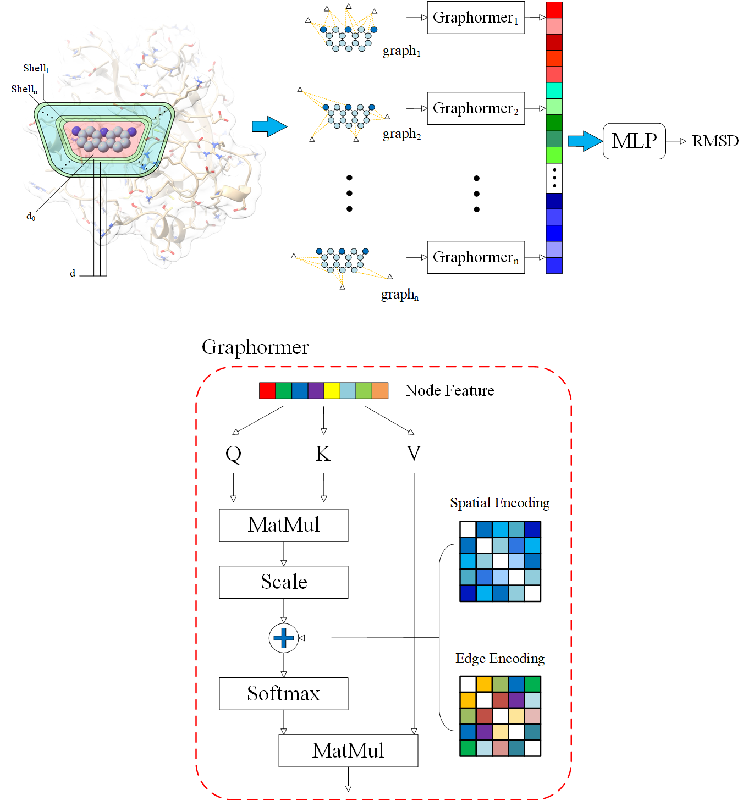

# GSScore
This algorithm is based on Graphormer model and shell-like architecture, and is designed to predict the RMSD value of protein-ligand conformations.

## Requirements

Please refer to Requirements.txt

## Contact
jxwang@mail.csu.edu.cn

## Usage
1. Prepare .h5 files:
	(a) Given a folder "PoseFolder" including docking poses, make sure the format is like below:
	PoseFolder
		PDB1
			Rec.pdb
			Lig_1.pdb
			......
			Lig_n.pdb
		PDB2
			Rec.pdb
			Lig_1.pdb
			......
			Lig_n.pdb
		......
	The Rec.pdb file represents the protein target in each complex folder, and the Lig_.pdb files represent all the ligand poses in PDB format. There must be a list file "Pose.dat" including poses informations in each complex like below:
	PDB1    Lig_1    -1
	PDB1    Lig_2    -1
	......
	PDB2    Lig_1    -1
	PDB2    Lig_2    -1
	......
	Here -1 means the true RMSD is unknown.
	(b) Run the PrepareData.py:
	python PrepareData.py -F ../examples/PoseFolder -O ../examples/PoseFolder_h5 -P 1 -S 10 --d0 5 --gap 0.5 --tmpfs /dev/shm/GSScore --list ../examples/PoseFolder/Pose.dat
	Use -h to get the explanation of the parameters.

2. Merge .h5 files into one .hdf5 file:
	Run the MergeHDFFiles.py:
	python MergeHDFFiles.py -F ../examples/PoseFolder_h5 -O ../examples/input.hdf5 -L ../examples/PoseFolder/Pose.dat

3. Predict the RMSD values of all the poses above
	Run the Predict.py:
	python Predict.py -N ../models/model.pt -T ../examples/input.hdf5 -L ../examples/PoseFolder/Pose.dat

4. To train your own GSScore model, run the Train.py:
	CUDA_VISIBLE_DEVICE=0 python -m torch.distributed.run --nproc_per_node=1 Train.py -F ../examples/input.hdf5 -L Train_pose.dat --num_epoch 150 --batch_size 4 --lr 0.0005 --opt 1 --num_producer_threads 2 --num_encoder_layers 16 --multi_hop_max_dist 8 --CheckData 1 --early_stop 50 --UseDegree 0 --emb_dim 128 --ffn_emb 128 --UseTmpfs 0 --shell 10 --pinmemory 0 --mlp 1
	Note: Train_pose.dat must include the true RMSD values (float) of all the poses for training, just like:
	PDB1    Lig_1    RMSD
	PDB1    Lig_2    RMSD
	......
	PDB2    Lig_1    RMSD
	PDB2    Lig_2    RMSD
	......
	For a demo, you can use ../examples/PoseFolder/Pose.dat instead of Train_pose.dat.
	If you have more powerful device, just set a larger batch_size. Here batch_size=4 is available for a laptop with 6GB GPU memory. Of course, it also available for multiple distributed GPU.

The output file format of Predict.py is like:
  -1|  Predicted_RMSD_1
  -1|  Predicted_RMSD_2
  -1|  Predicted_RMSD_3
......
Here -1 means the true RMSD is unknown. But in the examples folder, the true RMSD values are given in Pose.dat.
